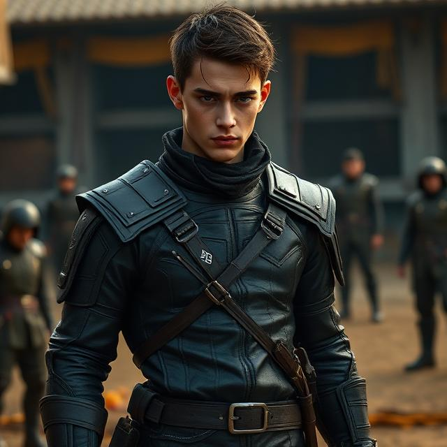

# Majeh Remington

[Character Sheet](https://docs.google.com/spreadsheets/d/1xIQzYPiwTRJDhqRyUlE_PAKBrnN5_PEAEJq_tittMvE/edit?usp=sharing)

## Starting Equipment

| Item | Cost |
| :-- | --: |
| Dagger | 2 GP
| Shortsword | 10 GP |
| Shortsword | 10 GP |
| Leather Armor | 10 GP |
| Costume x 3 | 15 GP |
| Diplomat’s Pack | 39 GP |
| Potion of Healing x 3 | -- |
| Bedroll | 1 GP |
| Tent | 2 GP |
| Backpack | 2 GP |
| **Total** | **91 GP** |

### Costumes

While wearing a Costume, you have Advantage on any ability check you make to impersonate the person or type of person it represents.

#### Courier
    Structured coat or tabard
    Matching trousers or skirt
    Polished boots
    Belt with insignia or badge space
    Cloak or mantle

#### Entertainer
    Flashy layered clothing (vest, open collar, flowing fabrics)
    Bright accents or jewelry
    Boots or soft shoes
    Prop-friendly design

#### Servant
    Plain, clean clothing (simple shirt + trousers or dress)
    Apron or waist wrap
    Soft shoes
    Hair tie, cap, or head covering

### Diplomat’s Pack

- Chest
- Fine Clothes
- Ink
- 5 Ink Pens
- Lamp
- 2 Map or Scroll Cases
- 4 flasks of Oil
- 5 sheets of Paper
- 5 sheets of Parchment
- Perfume
- Tinderbox.